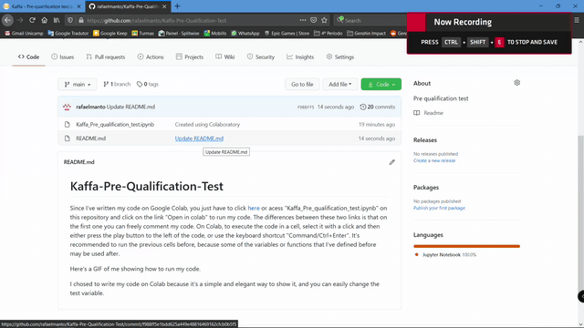

# Kaffa-Pre-Qualification-Test
Since I've written my code on Google Colab, you just have to click [here](https://colab.research.google.com/drive/1Lg9wXinPcSeqLTmLuK74dsVibRJjnF3C?usp=sharing) or acess "Kaffa_Pre_qualification_test.ipynb" on this repository and click on the link  "Open in colab" to run my code. The differences between these two links is that on the first one you can freely comment my code. On Colab, to execute the code in a cell, select it with a click and then either press the play button to the left of the code, or use the keyboard shortcut "Command/Ctrl+Enter". It's recommended to run the previous cells before, because some of the variables or functions that I've defined before may be used after.

Here's a GIF of me showing how to run my code.

I chose to write my code on Colab because it's a simple and elegant way to show it, and you can easily change the test variable.
